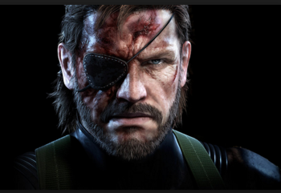

#cg-f15-22-rutgers
######Unity Projects - CG Fall 2015 @ Rutgers
######By: *Weilin Zhao, Beidi lu, Yehui Rong*
Check out our website: [cg-f15-22-rutgers](http://cg-f15-22-rutgers.blogspot.com/)

###B1: Navigation and Animation
1. I am a fun project!
2. Features
3. Description

###B2: Inverse Kinematics and Behavior Tree
1. I am a hard project!
2. Features
3. Description

###B3: Interactive Narrative Game
1. I am a real project!
2. Features
3. Description
